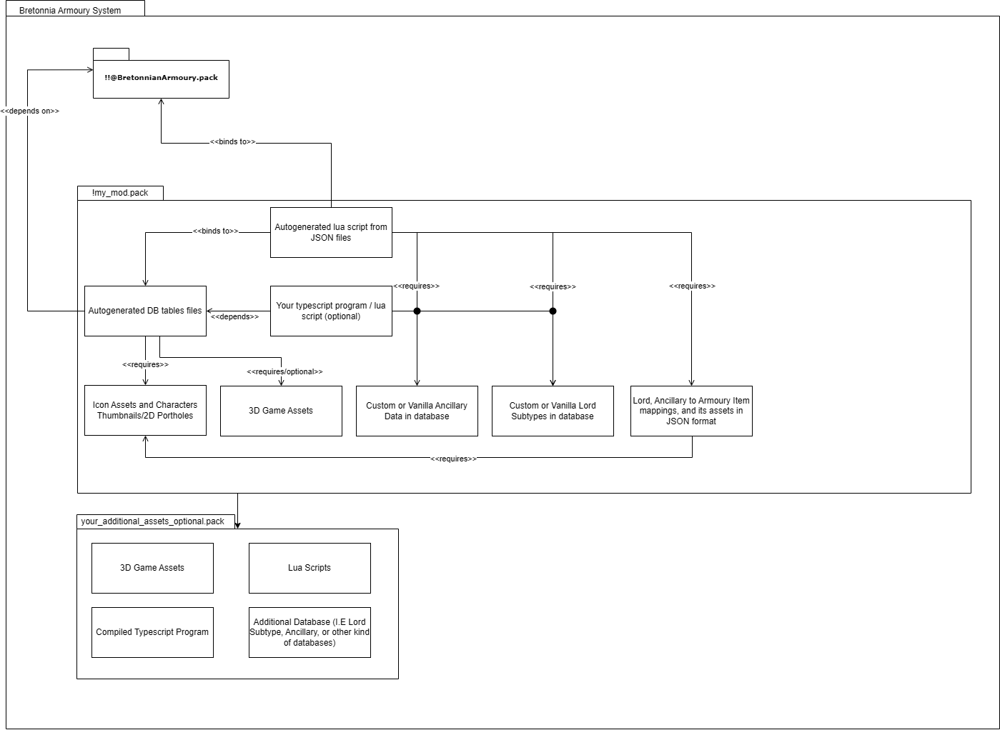
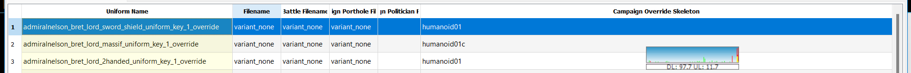
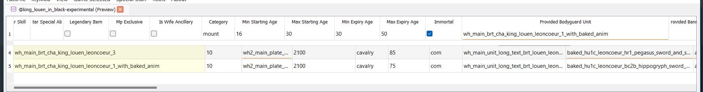

# Bretonnia Royal Armoury User Manual For Modders and Scripters

## What is it?
It's a typescript/javascript framework that enables Bretonnia (and other factions) to take advantage of Armoury system for Demons (aka Daniel). 

## Why?
Because Bretonnia deserved better paid DLC and mods, and I am tired of Emp* people pumping good content for their faction. Not enough good mods for Bretonnia. 

## When?
The project started in 2022 and just finished in late 2024. There were so many hurdles to overcome, from Ole's asset editor, DB research, trial/error, endless crashes.

## How does it work?

The diagram above explain how this framework works.
### Required Data
Keep in mind this is for new mod that utilise this framwork. If you're making a sub mod for a mod that use this framework, you'll only need to override some tables which will be explained in the next chapter.
1. Lord, Ancillary to Armoury Item mappings, and its assets in JSON format  
The user must define the ancillary, lord, and armoury to ancillary in JSON format. Check the respectives folder for examples and format.  
⚠️ Ensure that the lord subtype, the animations, the variantmesh path, and ancillary keys do not have misspellings or it will cause bug like invisible character, ancillary not mapping correctly to its armoury item when given, ancillary does nothing, or bugged animation.
2. Custom or Vanilla Lord Subtypes in database  

If you're using Vanilla lord then some additional steps are needed: you need to override the agent uniform with empty variant mesh and define it's skeleton overrides, it must match with the land_unit skeleton animation. Otherwise more work is needed in the provided pack in the root directory or provide the lord data from external packs. 
- ⚠️ This will crash the game if :
    - Lord has skill trees incorrectly defined
    - Undefined agent subtype localisation (.loc strings)
    - Agent uniform skeleton overrides is not defined in agent uniforms table
    - Not using empty variant  in agent uniforms table (it's not actually empty but variant mesh that only contain slots)
- ⚠️ This will cause appearance bug (invisible lord, lord reverting to variant mesh, not using the armoury in battle) if :
    - The land_unit animation type is type of "war_beast"
    - Some mod or vanilla table uses the land_unit with battle personalities table, you may need to use new land unit data in this case that doesn't use battle personality table (basically rewiring the ancillary provided body guard to new). 
3. Custom or Vanilla Lord Ancillaries in database
If you're using Vanilla ancillaries then no more additional steps are needed. Otherwise you must define the ancillaries in the root directory or provide them via external packs.
4. Your typescript program (optional)  
If you're implementing somekind of submod or can't override the agent uniform (needs to change them during in-game via script) or additonal gameplay script, you can do that here. It's recommended to use Typescript on this framework, because the build script will not pack .lua files automatically unless in runtime directory (which will be put inside _lib directory in the pack). 
5. Icon Assets and Characters Thumbnails/2D Portholes
Your armoury item needs icon to display, the filename must match with the armoury name too. If the armoury item type is **head** then the porthole thumbnail and unit card thumbnail names must match with the armoury item name. It is recommended to use the same thumbnail as in your porthole .bins just for visual consistency. 
6. Your 3d game assets could be inserted into the provided pack in the root directory or via external pack as illustrated in the diagram. 

### Generated Data
Everytime compile.bat is executed the build script will run following action:
1. It cleans the build directory
2. Checks for the JSON files in following directories: armoury_data, armoury_definitions, armoury_to_ancillary. 
it will also checks for any duplicates, undefined references in armoury_definitions and 2D file paths. 
⚠️ The script can't check for 3D assets file path from the packs. Wrong 3D could cause invisible mesh in game.
⚠️ The script can't check if the skeleton name is correct or not, wrong skeleton name could cause animations bug or crash if it's invalid
⚠️ The script can't check if the effects, scope, or value used in armoury_to_ancillary are valid or not. Any invalid value on this part could cause the game unbootable.
⚠️ The script can't check if the subtypekey is correct or not, wrong subtypekey could cause the game unbootable.
3. Generate dummy assets with "const_kitbasher_dummy_" prefix
4. Generate tables
5. Generate localisation tables
6. Copying 2D assets
7. Generate dummy variantmeshdefinition files
8. Generate variantmeshdefinition files
9. Generate  Typescript source code that maps ancillary with compatible lords to their armoury item from parsed JSON files
10. Compile all Typescript source code into typescript program as lua script (including user own made source code in campaign directory)
11. Package everthing as a single pack file with name from compile.bat
12. Clean the build folder

📝Note: `--faction` switch is no longer used anymore. Yes, you can use any faction with this framework as long the `!!@BretonnianArmoury.pack` is loaded

### Empty Variantmeshdefinitions with slots
```xml
<VARIANT_MESH>
    <SLOT name="head" />
	<SLOT name="torso" />
	<SLOT name="wings" />
	<SLOT name="legs" />
	<SLOT name="left_arm" />
	<SLOT name="right_arm" />
	<SLOT name="tail" />
	<SLOT name="weapon_1" attach_point="be_prop_0" />
	<SLOT name="weapon_2" attach_point="be_prop_1" />
	<SLOT name="shield"   attach_point="be_prop_2" />
	<SLOT name="weapon_3" attach_point="be_prop_3" />
	<SLOT name="weapon_4" attach_point="be_prop_4" />
	<SLOT name="weapon_5" attach_point="be_prop_5" />
</VARIANT_MESH>
```